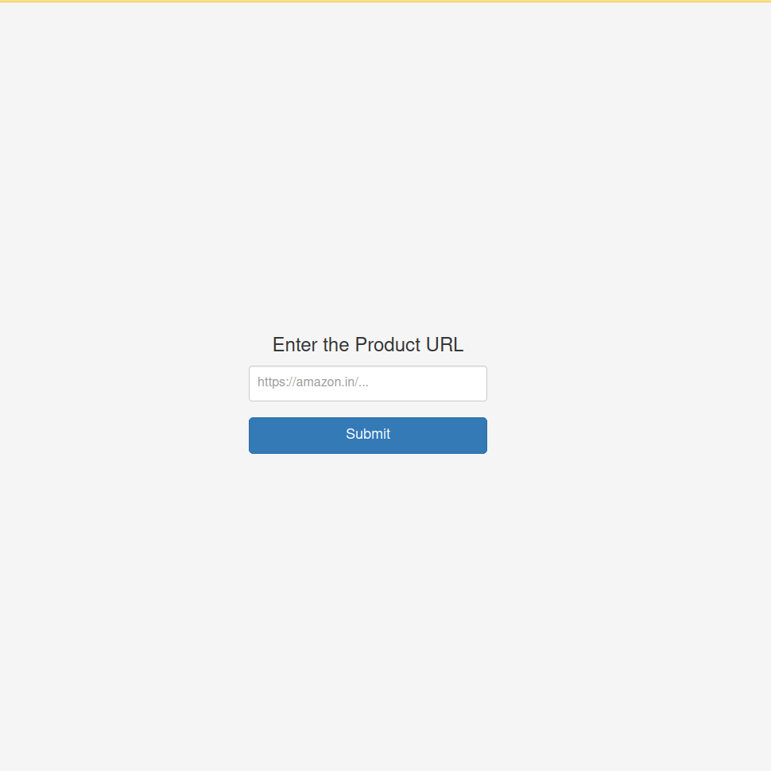
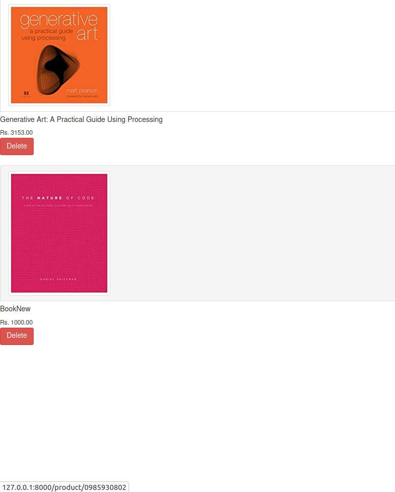

# Amazon Price Tracker
A web application developed with **Python** and the **Django Web Framework**, it scrapes an e-commerce website (amazon.in, for the time being) using the URL provided by the user and adds it to the user's list to be managed and tracked easily.

The user just needs to copy the product URL from amazon page and paste into our application, and voila! the product will now be tracked by us and important details and notifications will be sent out to the user.

## Technologies Used:
- **Python and Django Web Framework** - To develop the backend structure logic of the application
- **PostgresSQL** - Database used to store the products and users information
- **Celery** - Task Queue to schedule tasks concerning updation of products. Uses **RabbitMQ** as the message broker
- **HTML, CSS, and Bootstrap** - Constitute the front-end portion for the project (not really a front-end guy )

## Steps to run the project:
- Clone the Github repository - https://github.com/prateekb1912/amazon-price-tracker
- Change directory to amazon-price-tracker/
- (Make sure you have Docker and docker-compose installed on your machine)
- Run the following commands to start the containers - 
  - `docker-compose build`
  - `docker-compose up -d`
- Navigate to the site [http://locahost:8000](http://locahost:8000)

| 
| :-:
| **Home Page**

|
| :-:
| **Products List**

# Work in Progress
These features are either being currently implemented or are considered to be implemented some time on :
- [ ] Utilize the **Scrapy** framework for its asynchronous scraping, pipelines, database integration, etc.
- [ ] Add other e-commerce sites like **Flipkart**, **Myntra**, **Tata CliQ** to name a few.
- [ ] Distinguish the products as their separate categories like books, clothing, electronics (may further be declassified), etc.
- [x] **Dockerize** the whole project and **Deploy** it.

## Learning Resources
Here are a few resources from where I learnt a lot about some technologies used above (assuming you know a thing or two about Python):
- **Django and PostgresSQL** - [How To Use PostgreSQL with your Django Application on Ubuntu 20.04](https://www.digitalocean.com/community/tutorials/how-to-use-postgresql-with-your-django-application-on-ubuntu-20-04)
- **Celery and Celery-Beat** - [ How to schedule ‘the Boring Stuff’ with Django and Celery Beat ](https://www.merixstudio.com/blog/django-celery-beat/)
- **Scrapy** - [Easy web scraping with Scrapy | ScrapingBee](https://www.scrapingbee.com/blog/web-scraping-with-scrapy/)
- **Dockerizing Django** - [Dockerizing Django with Postgres, Gunicorn, and Nginx | TestDriven.io](https://testdriven.io/blog/dockerizing-django-with-postgres-gunicorn-and-nginx/)
